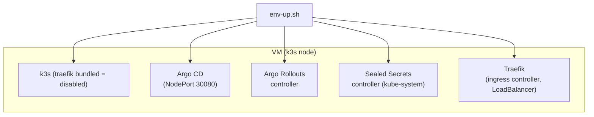
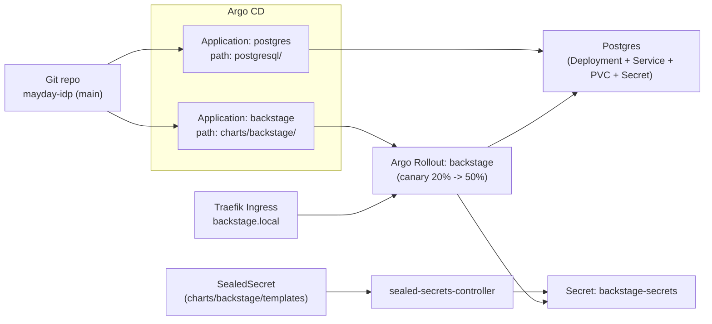
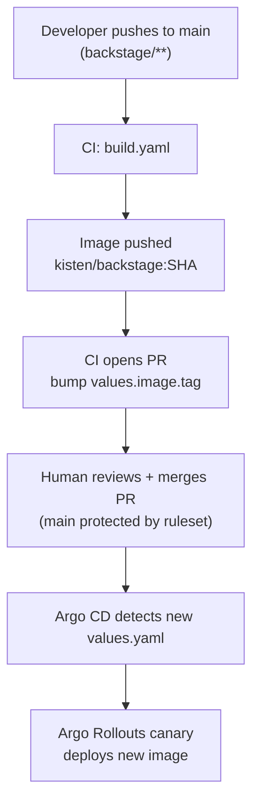

# Architecture

This document describes how the **mayday-idp** lab is structured and how a change
flows from source code to a running deployment via GitOps.

## Layers

| Layer | Path | Role |
|-------|------|------|
| Bootstrap | `env-up.sh`, `env-up2.sh` | Provision the cluster + platform controllers (k3s, kubectl, Helm, Argo CD, Sealed Secrets, Argo Rollouts, Traefik). |
| Delivery (GitOps) | `argocd/` | Argo CD `Application`s that reconcile Git → cluster. |
| App — portal | `charts/backstage/` | Helm chart for the Backstage portal (Argo Rollout, Service, Ingress, ConfigMap). |
| App — database | `postgresql/` | Postgres backing store for Backstage. |
| Secrets | `scripts/seal-backstage-secret.sh` → `charts/backstage/templates/sealedsecret.yaml` | Encrypted `backstage-secrets` via Sealed Secrets (no plaintext in Git). |
| CI | `.github/workflows/build.yaml` | Build & push the Backstage image, then open a PR bumping `values.image.tag`. |
| Self-service | `app-template/` | Base Helm chart used by Backstage software templates to scaffold new apps (STG/PRD values). |
| Source | `backstage/` | Backstage monorepo (portal source; `packages/backend/Dockerfile` is what CI builds). |

## Platform components (bootstrap)

## GitOps delivery

Argo CD watches this repo and reconciles two applications into the `backstage` namespace:

## End-to-end change flow

> The bump PR only touches `charts/backstage/values.yaml`, which is outside the
> build workflow's `paths` filter (`backstage/**`, `.github/workflows/*`), so
> merging it does not re-trigger the build — no deploy loop.

## Access

- **Argo CD UI:** `http://<node-ip>:30080` (Service type NodePort).
- **Backstage:** `http://backstage.local` via the Traefik Ingress
  (add `<node-ip> backstage.local` to `/etc/hosts`).

## Bootstrap order

1. `env-up.sh` — cluster + controllers (Argo CD, Sealed Secrets, Argo Rollouts, Traefik).
2. Rotate the GitHub credentials, then `scripts/seal-backstage-secret.sh` to create the `SealedSecret`.
3. Apply `argocd/postgres-application.yaml` (database first — Backstage depends on it).
4. Apply `argocd/backstage-application.yaml`.
5. Add the `/etc/hosts` entry and set the GitHub App callback to
   `http://backstage.local/api/auth/github/handler/frame`.
